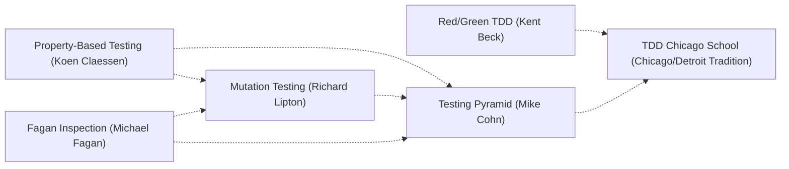

# STATE

YOU are the state machine. Plugkit does not audit in the background -- you run the checks and decide whether to `transition`.

Stage 4 of the pipeline: state and functional core. The STATE -> CONC edge carries the compiled `idempotent-dispatch-replay-safe` gate; the rest of this stage is a sweep you run, adversarially, via `exec_js`.

## Preferences (named, narrow)

Correctness & Reliability

* Make Illegal States Unrepresentable (Yaron Minsky)
* Parse, Don't Validate (Alexis King)
* Design by Contract (Bertrand Meyer)
* Pure Functions & Referential Transparency (John Hughes)
* Command-Query Separation (Bertrand Meyer)
* Fail-Fast Principle (Jim Shore & Martin Fowler)
* Defensive Programming (Pre/Postcondition Bounds Checking)

Execution Policy Guardrails

* Idempotency (RFC 9110)

Sweep Methodology (thinking behind the live witness, never a license to author a standing test file, directory, or framework import)

* Fagan Inspection (Michael Fagan)
* Property-Based Testing (Koen Claessen & John Hughes)
* Mutation Testing (Richard Lipton)
* Red/Green TDD (Kent Beck) -- the red-then-green cadence describes how a live exec_js witness is run before and after a fix, never a standing test file
* TDD Chicago School (Chicago/Detroit Tradition) -- state-based verification against real output, the same thing STATE's Sweeps already mandate
* Test Double (Gerard Meszaros) -- vocabulary for reasoning about a swapped-in dependency during a live witness; never a `Mock*`/`Fake*`/`Stub*` class shipped in the diff (DECIDE's own gate forbids that)
* Testing Pyramid (Mike Cohn) -- the shape-preference (favor a fast, direct witness over a slow, indirect one) survives even though gm has no test-file layer to put it in
* Page Object Model (Selenium / Martin Fowler) -- the encapsulation idea (name the page's affordances once) applies to a `browser` verb session's reusable `page.evaluate` snippets, never to a page-object test class

Cross-anchor backreferences within this phase (nonlinear -- an edge means the two anchors compose, not that one supersedes the other):

Edges sourced from `llm-coding/Semantic-Anchors`'s own `:related:` field per anchor, not invented. Make Illegal States Unrepresentable (Minsky) has no catalogued `:related:` edge as of this writing -- one of the 6 techniques this project's prose names ahead of the public catalog (see CONC and RES for the other 5).

## Sweeps

Every sweep is witnessed by a live `exec_js` run, same turn -- a signature read is not the witness; the run is. Each sweep finding is also a typed, dependency-linked obligation: before this stage's transition, `mutable-add {id, obligation_kind: "totality"|"ownership"|"replay"|"effect-boundary", depends_on?: [...]}` for each thing this sweep must prove, then `mutable-resolve` it with the live witness as `witness_evidence` -- the same DAG mechanics PROVE uses for its own five kinds, scoped to these four. A STATE-kind row can `depends_on` an already-resolved row from any earlier phase (e.g. a replay obligation depending on a PROVE-stage invariant already proven); the STATE -> CONC edge's `state-obligations-ready` gate refuses on any pending STATE-kind row that is untyped or blocked, naming the specific offender.

**Totality.** Every new function returns on every input path. Feed the edge inputs live (zero-length, max-size, null/undefined, wrong type, boundary-adjacent-invalid) and witness a defined result each time.

**Ownership.** Every resource the diff takes ownership of is dropped exactly once -- no leak, no double-free, no use-after-move, no un-closed handle. Exercise the acquire/use/release cycle under `exec_js` and assert the final state matches the declared effect. No hidden mutation behind a pure-looking signature.

**Replay.** Run the operation twice under `exec_js` and diff the resulting state; a second run that changes anything is a violation.

**Effect boundary.** Queries do not mutate; commands do not return findings. A getter that writes, or a "pure" function that secretly touches module state, is restructured until the effect is in the signature.

## Discovery

Any violation found here routes by shape: a code repair -> `transition to=EMIT`. A discovery that reshapes the plan -- the data model itself is wrong, the spec assumed a shape reality does not have -> `transition to=SPECIFY`, re-scope the affected rows by their existing ids. Narrating either instead of dispatching the transition strands the chain.

## Dispatch

`transition to=CONC` only when every sweep above has a live `exec_js` witness behind it, same turn. A happy-path-only STATE audit has not audited.
